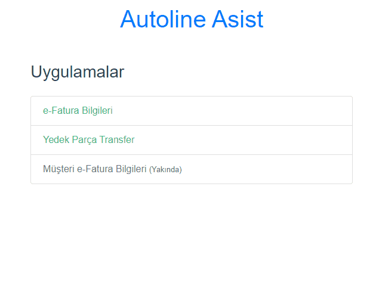

# Autoline Assist

**Autoline Assist (Windows x86)**  - [İndir](https://github.com/HasOtomotiv/AutolineAssist/releases/download/v1.0/AutolineAssist.zip)

---

---

##### Görüş ve önerileriniz için
[acikkaynak@has.com.tr](mailto:acikkaynak@has.com.tr)

## Programın gereksinimleri:
* Autoline ODBC client
* Autoline ODBC user/password
* Config dosyası: autolineassist.toml

## Programın derlenmesi:
```bash
# frontend
cd webui
npm install
npm run build
cd ..
go mod download
statik -src=webui/dist

# run
env CGO_ENABLED=0 GOOS=windows GOARCH=386 go run ./cmd

# build
env CGO_ENABLED=0 GOOS=windows GOARCH=386 go build -ldflags="-w -s" -o ./bin/AutolineAssist.exe ./cmd

```
